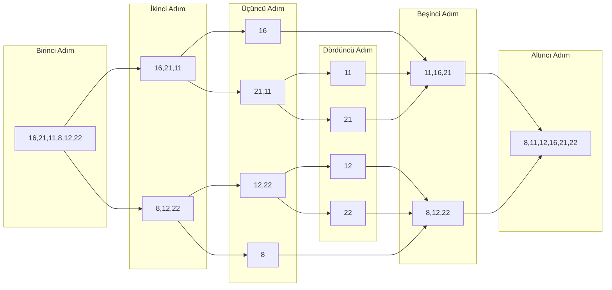

# Merge Sort Projesi

## Proje 2

`[16,21,11,8,12,22]` --> Merge Sort

1.  Yukarıdaki dizinin sort türüne göre aşamalarını yazınız.
2.  Big-O gösterimini yazınız.

---

1. Aşamaları:

2.  Merge Sort Big-O: $O(n*\log n)$
